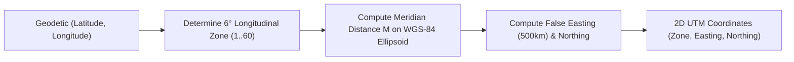

# UTM Coordinate Map Projection Skill

Conformal map projection algorithm mapping the WGS-84 curved ellipsoid surface to a 2D Cartesian grid plane.

## Features
- **100% Python Standard Library**: High-order Taylor series truncation.
- **Standard Cartographic Output**: Compatible with global GIS mapping services.
